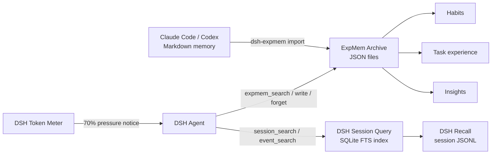

# DSH ExpMem

English | [简体中文](README.zh-CN.md)

**Experience Memory for DeepSeek Harness.**

DSH ExpMem is a community plugin, not an official DeepSeek project. It gives a DSH agent a file-backed Archive for distilled user habits, task experience, and reusable insights while reusing DSH's existing session history as Recall.

## Architecture



- **Recall** is verbatim prior-session history. DSH already stores it in JSONL and provides search through `dsh-session-query`.
- **Archive** is stable knowledge deliberately distilled by the agent. ExpMem stores one readable JSON file per record.
- **Pressure promotion** asks the current agent to preserve high-value experience before DSH compacts the context.
- ExpMem does not duplicate session events or modify the Agent Loop.

## Install

```sh
dsh plugin --profile web add @creative-dswork/dsh-expmem
```

The bundle:

1. enables the existing DSH session-query SQLite backend on first search;
2. adds DSH's `session_search`, `session_event_search`, trace, and read tools;
3. adds `expmem_search`, `expmem_write`, and `expmem_forget`;
4. enables one ExpMem promotion notice per DSH compaction cycle.

Start DSH normally:

```sh
dsh web
```

## Import Claude Code and Codex Memory

Preview and then import both agents' generated Markdown memories:

```sh
pnpm dlx @creative-dswork/dsh-expmem import all --dry-run
pnpm dlx @creative-dswork/dsh-expmem import all
```

The defaults are `~/.claude/projects/**/memory/*.md` for Claude Code and
`$CODEX_HOME/memories/**/*.md` (or `~/.codex/memories/**/*.md`) for Codex.
Override custom locations when needed:

```sh
pnpm dlx @creative-dswork/dsh-expmem import claude --claude-dir /path/to/memory
pnpm dlx @creative-dswork/dsh-expmem import codex --codex-dir /path/to/memories
```

Each source file becomes one `experience` record with its provider, absolute source path, and
SHA-256 provenance. Repeating the command skips unchanged files and updates changed files in
place. Source files are never modified or deleted. Use `--workspace /path/to/project` to attach
an explicit project scope; the default Claude layout is mapped to its project when that mapping
is unambiguous.

## Storage

The default files are:

```text
$DSH_HOME/
├── sessions/                         # DSH-owned Recall JSONL
└── expmem/
    ├── recall-index.sqlite           # derived DSH full-text index
    └── archive/
        ├── habit/<uuid>.json
        ├── experience/<uuid>.json
        └── insight/<uuid>.json
```

Archive records contain their category, title, content, tags, timestamps, optional source
workspace/session, and import provenance. Writes use a temporary file plus atomic rename.

## Tools

| Tool | Purpose |
|---|---|
| `session_search` | Find relevant prior sessions in the current workspace. |
| `session_event_search` | Search events inside one prior session. |
| `expmem_search` | Search distilled experience across projects or one exact workspace. |
| `expmem_write` | Create a record or update an existing UUID. |
| `expmem_forget` | Delete one Archive record by category and UUID. |

ExpMem instructs the agent to store only stable, verified knowledge and to avoid secrets, transient progress, raw logs, and unverified assumptions.

## Pressure Promotion

Before each model step, ExpMem reuses DSH's token meter to measure the current context. At the
default 70% threshold, it adds one synthetic user notice asking the agent to search existing
ExpMem records and preserve at most three durable habits, experiences, or insights before
continuing the original task.

The notice is stored in the DSH session log, so ExpMem emits it only once per successful
compaction cycle. If DSH compacts before the notice can be delivered, ExpMem instead cites the
compacted event range and asks the agent to recover the original messages from Recall. No
background worker or separate LLM summarizer is involved.

## Configuration

Override the `expmem` row in the profile's `cordis.patch.yml`:

```yaml
- id: expmem
  config:
    rootDir: /absolute/path/to/expmem
    maxEntryChars: 20000
    maxPreviewChars: 1000
    maxSearchResults: 20
    promotionEnabled: true
    warningRatio: 0.7
    maxPromotionsPerCycle: 3
    recoveryAfterCompaction: true
```

`rootDir` must be absolute. Search is a case-insensitive literal AND over whitespace-separated terms. An empty query lists the newest records.
Pressure promotion activates only when the active DSH composition provides both the token meter
and model context-window metadata.

To change Recall indexing, override the bundle's existing row:

```yaml
- id: session-query-sqlite
  config:
    path: /absolute/path/to/recall-index.sqlite
    openAt: first-search
```

## Development

```sh
pnpm install
pnpm run check
pnpm run pack:dry-run
```

Install this checkout into a profile:

```sh
dsh plugin --profile web add .
dsh --profile web --dump-config
```

## Current Scope

- Archive search is a transparent linear scan; add an index only after corpus size demonstrates the need.
- Promotion is cooperative: the current agent decides which records qualify and may decline to write any.
- No embeddings, background LLM summarizer, semantic deduplication model, or retention scheduler is included.
- Recall deletion and retention remain owned by DSH session persistence.

## License

[MIT](LICENSE)
