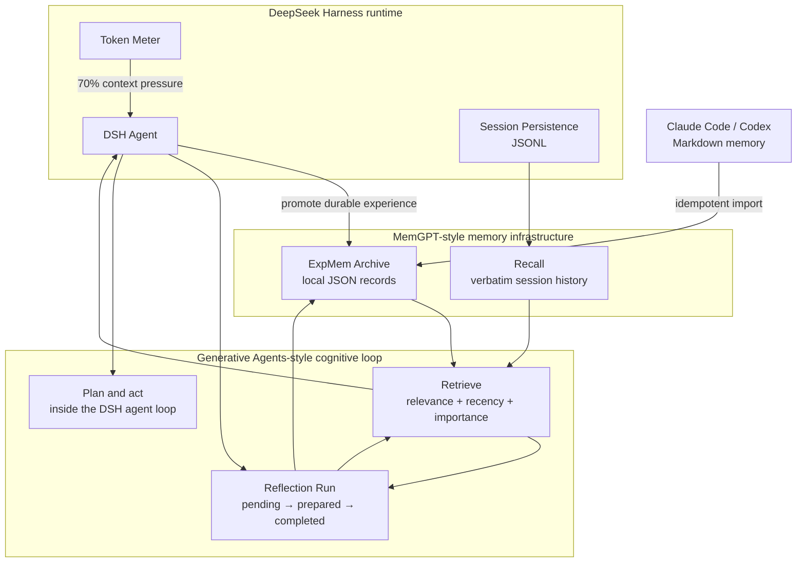

# DSH ExpMem

English | [简体中文](README.zh-CN.md)

**Experience Memory for DeepSeek Harness.**

## Introduction

DSH ExpMem is a community plugin for long-term personal memory in
[DeepSeek Harness](https://github.com/deepseek-ai/deepseek-harness). It keeps user habits,
reusable task experience, and engineering insights in inspectable local files. DSH's existing
Session history remains the verbatim Recall layer.

The design combines two research lines. MemGPT supplies the memory infrastructure: tiered
storage, memory pressure, retrieval, and explicit memory operations. Generative Agents supplies
the cognitive process: assign importance, retrieve by current relevance, synthesize reflections,
and use those memories when planning the next action.

DSH ExpMem is not an official DeepSeek project.

## Architecture



DSH owns Recall, context compaction, and the Agent Loop. ExpMem owns the distilled Archive,
retrieval ranking, reflection provenance, and the trustworthy memory lifecycle. It does not copy
Session events.

### Context Engineering

The design maps to four common Context Engineering operations:

| Technique | Coverage | Implementation |
|---|---|---|
| **Write Context** | Covered | DSH persists messages and tool events as Session Recall. The agent stores habits, reusable experience, and insights through `expmem_write`, promoting durable knowledge at 70% context pressure. |
| **Select Context** | Covered | `session_search` and `session_event_search` retrieve verbatim history. `expmem_search` ranks long-term memories by relevance, recency, and importance, and Reflection Runs reuse the same retrieval path. |
| **Compress Context** | Covered | DSH Compaction merges older history and prior checkpoints into a new `<compacted-summary>` while original events remain in the Session Log. ExpMem prompts the agent to preserve high-value experience before compaction and recovers from Recall if the notice was missed. |
| **Isolate Context** | Covered at the framework layer | DSH gives each subagent its own Session. A fork copies a snapshot of completed parent history, then accumulates context independently. ExpMem scopes long-term memory by workspace and reserves Reflection Runs for the main agent. |

## Highlights

- **Tiered memory:** DSH Session JSONL holds raw history; ExpMem stores habits, experience, and
  insights as one JSON file per record.
- **Pressure-aware promotion:** a 70% context notice asks the current agent to preserve durable
  knowledge before compaction. Recall recovery covers threshold jumps.
- **Personalized retrieval:** search combines relevance, recency, and agent-assigned importance.
  Returned memories condition later planning and reactions.
- **Auditable reflection:** higher-level insights cite the observations or earlier reflections
  that support them. Persistent Reflection Runs resume after interruption and consume only cited
  source revisions.
- **Trust lifecycle:** candidate, verified, disputed, and superseded states preserve provenance,
  conflicts, and replacement history. Confirmed deletion leaves a minimal tombstone.
- **Local and lightweight:** ExpMem adds no vector database, background worker, or second model
  request. It does not modify the DSH Agent Loop.

## Claude Code and Codex compatibility

ExpMem imports the agent-generated Markdown memories from both tools:

```sh
pnpm dlx @creative-dswork/dsh-expmem import all --dry-run
pnpm dlx @creative-dswork/dsh-expmem import all
```

The defaults are `~/.claude/projects/**/memory/*.md` for Claude Code and
`$CODEX_HOME/memories/**/*.md` (or `~/.codex/memories/**/*.md`) for Codex.
Override custom locations when needed:

```sh
pnpm dlx @creative-dswork/dsh-expmem import claude --claude-dir /path/to/memory
pnpm dlx @creative-dswork/dsh-expmem import codex --codex-dir /path/to/memories
```

Each source file becomes a candidate `experience` record with imported-file evidence: provider,
absolute source path, SHA-256, and observation time. ExpMem skips unchanged files. A changed
candidate updates in place; a changed verified, disputed, or superseded record produces a new
candidate and leaves the earlier record intact.

ExpMem never modifies or deletes source files. Use `--workspace /path/to/project` to attach an
explicit project scope; the default Claude layout is mapped to its project when that mapping is
unambiguous.

## Research foundations

### MemGPT

[MemGPT: Towards LLMs as Operating Systems](https://arxiv.org/abs/2310.08560) treats an LLM's
context window as scarce working memory and moves information through a storage hierarchy.
ExpMem applies four parts of that design:

- DSH context is the working set;
- DSH Session history is Recall;
- ExpMem JSON records are the Archival store;
- pressure notices give the agent time to preserve important experience before compaction.

### Generative Agents

[Generative Agents: Interactive Simulacra of Human Behavior](https://arxiv.org/abs/2304.03442)
describes a memory stream that supports retrieval, reflection, and planning. ExpMem applies its
memory-specific mechanisms:

- each record carries importance and a most recent access time;
- retrieval combines relevance, recency, and importance;
- reflections are insight records with citations to their source memories;
- accumulated importance triggers reflection by the current agent.

Active plans stay in DSH task and Session state because they change during execution. ExpMem
stores the durable habits, experience, and reflections that should influence later plans.

## Install

```sh
dsh plugin --profile web add @creative-dswork/dsh-expmem
```

The bundle enables DSH Session Query, registers the Recall and ExpMem tools, and installs memory
pressure and reflection notices. Start DSH normally:

```sh
dsh web
```

## Storage

The default files are:

```text
$DSH_HOME/
├── sessions/                         # DSH-owned Recall JSONL
└── expmem/
    ├── recall-index.sqlite           # derived DSH full-text index
    ├── archive/
    │   ├── habit/<uuid>.json
    │   ├── experience/<uuid>.json
    │   ├── insight/<uuid>.json
    │   └── tombstones/<uuid>.json
    └── reflection-runs/
        └── <uuid>.json
```

Schema v1 records contain the claim, `candidate|verified|disputed|superseded` status, author,
evidence, importance, last access time, optional workspace, and record relations. ExpMem reads
0.2.x and earlier v1 records with compatible defaults. A malformed or future-version file
produces a scan warning without hiding valid records in the same directory.

Each write creates a temporary file in the target directory and atomically renames it. Searches
read only final `.json` files, so an interrupted temporary write cannot become a partial record.

## Trust lifecycle

New records and imported memories start as `candidate`. `expmem_transition` can mark a candidate
`verified` only when its verification points to qualifying evidence:

- a user confirmation anchored to a complete DSH Session event range;
- a tool reproduction anchored to a complete event range;
- a source check linked to external URI evidence.

A record can move from candidate or verified to `disputed`. A verified replacement may declare
one-way `supersedes` links; ExpMem computes `supersededBy` when it reads the archive. Disputed
records may declare record-level `conflictsWith` links. ExpMem keeps the earlier claims instead
of rewriting them.

External review reports are opaque evidence. ExpMem stores the report schema, ID, location,
report SHA-256, and the SHA-256 of the exact claim reviewed. It does not open report locations,
parse verdicts, run review models, or grant `verified` from a report alone.

## Ranked retrieval and reflection

Each memory has an `importance` score from 1 to 10 and a `lastAccessedAt` timestamp. Search ranks
matching records with the three factors from *Generative Agents*:

```text
score = normalized(recency) + normalized(importance) + normalized(relevance)
recency = 0.995 ^ hours_since_last_access
```

Relevance is literal query-term coverage. Search updates `lastAccessedAt` only for hits returned
to the agent.

An insight may include `reflection: { question, sourceMemoryIds }`. The source IDs form an
auditable reflection tree and may point to observations or earlier reflections. A reflection
with no ExpMem source must cite a complete DSH Session event range.

After unreflected memories accumulate 30 importance points, ExpMem creates a persistent
Reflection Run:

```text
pending
  → prepare high-level questions and retrieve evidence
  → commit cited insight candidates
  → completed
```

An interrupted run resumes on the next turn or after restart. Commit is idempotent, and a
completed run consumes only the exact source revisions cited by its insights. Uncited records
remain eligible for a later run. A source revision is bound to its claim SHA-256 and importance.
ExpMem makes no second model call. Active plans remain in DSH task and Session state rather than
the long-term Archive.

The notice supplies the Run ID. The main agent first submits its questions:

```json
{
  "action": "prepare",
  "runId": "<run-uuid>",
  "questions": [
    "Which implementation practices have repeatedly improved review reliability?"
  ]
}
```

ExpMem returns a `questionId` and ranked memory hits for each question. The agent then commits
one cited insight per question:

```json
{
  "action": "commit",
  "runId": "<run-uuid>",
  "insights": [
    {
      "questionId": "<question-uuid>",
      "title": "Evidence before conclusions",
      "content": "Focused changes and explicit evidence improve review reliability.",
      "importance": 8,
      "sourceMemoryIds": ["<memory-uuid>"]
    }
  ]
}
```

ExpMem accepts only memory IDs returned for that question. It writes each result as an `insight`
candidate; completing a Run does not verify the claim.

ExpMem identifies subagents through the durable Session header
`origin: "subagent"`. Subagents do not receive Reflection Run notices, and `expmem_reflect`
rejects calls from them. A normal fork with `parentSession` remains eligible.

## Tools

| Tool | Purpose |
|---|---|
| `session_search` | Find relevant prior sessions in the current workspace. |
| `session_event_search` | Search events inside one prior session. |
| `expmem_search` | Rank relevant experience by recency, importance, and relevance. |
| `expmem_write` | Create or update a candidate, including importance and reflection provenance. |
| `expmem_reflect` | Prepare or commit a persistent Reflection Run. |
| `expmem_transition` | Verify or dispute a record with evidence; add conflicts or supersession. |
| `expmem_forget` | Delete a candidate and leave a minimal tombstone. |

Search returns candidate, verified, and disputed records by default. Request `superseded`
explicitly when inspecting history. ExpMem tells the agent to treat candidate and disputed
records as unverified and to avoid secrets, transient progress, and raw logs.

## Confirmed deletion

The Agent tool deletes candidates only. Delete a verified, disputed, or superseded record through
the CLI:

```sh
pnpm dlx @creative-dswork/dsh-expmem forget insight <uuid> \
  --reason-code incorrect
```

The command prints the record's ID, kind, status, and title, then asks for confirmation. Use
`--yes` for an already approved non-interactive operation and `--json` for machine-readable
output. The tombstone contains only schema version, ID, kind, deletion time, and reason code.

## Pressure Promotion

Before each model step, ExpMem reuses DSH's token meter to measure the current context. At the
default 70% threshold, it adds one synthetic user notice asking the agent to search existing
ExpMem records and preserve at most three durable candidates before continuing the original
task.

The notice is stored in the DSH session log, so ExpMem emits it only once per successful
compaction cycle. If DSH compacts before the notice can be delivered, ExpMem instead cites the
compacted event range and asks the agent to recover the original messages from Recall. No
background worker or separate LLM summarizer is involved.

## Configuration

Override the `expmem` row in the profile's `cordis.patch.yml`:

```yaml
- id: expmem
  config:
    rootDir: /absolute/path/to/expmem
    maxEntryChars: 20000
    maxPreviewChars: 1000
    maxSearchResults: 20
    promotionEnabled: true
    warningRatio: 0.7
    maxPromotionsPerCycle: 3
    recoveryAfterCompaction: true
    reflectionEnabled: true
    reflectionThreshold: 30
    recencyDecay: 0.995
```

`rootDir` must be absolute. Search considers records matching at least one case-insensitive
literal term, then ranks them. An empty query ranks all records allowed by the filters.
Pressure promotion activates only when the active DSH composition provides both the token meter
and model context-window metadata.

To change Recall indexing, override the bundle's existing row:

```yaml
- id: session-query-sqlite
  config:
    path: /absolute/path/to/recall-index.sqlite
    openAt: first-search
```

## Development

```sh
pnpm install
pnpm run check
pnpm run pack:dry-run
```

Install this checkout into a profile:

```sh
dsh plugin --profile web add .
dsh --profile web --dump-config
```

## Current Scope

- Archive search is a transparent linear scan; add an index only after corpus size demonstrates the need.
- Promotion is cooperative: the current agent decides which records qualify and may decline to write any.
- No embeddings, background LLM summarizer, semantic deduplication model, or retention scheduler is included.
- ExpMem stores external review-report links but does not run or parse an audit pipeline.
- Recall deletion and retention remain owned by DSH session persistence.

## License

[MIT](LICENSE)
