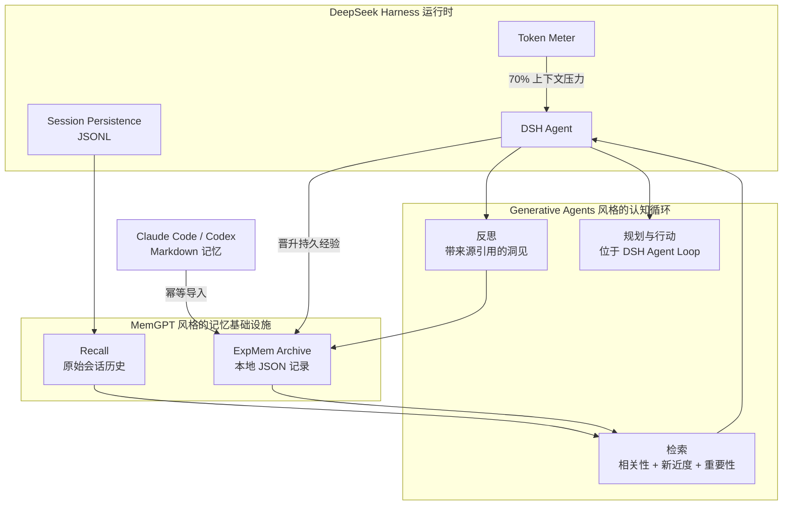

# DSH ExpMem

[English](README.md) | 简体中文

**面向 DeepSeek Harness 的经验记忆。**

## 介绍

DSH ExpMem 是 [DeepSeek Harness](https://github.com/deepseek-ai/deepseek-harness) 的社区长期
记忆插件。它把用户习惯、可复用任务经验和工程洞见保存在可检查的本地文件中，并继续使用
DSH Session 历史作为原始 Recall。

设计结合了两条研究路线。MemGPT 提供记忆基础设施，包括分层存储、压力检测、检索和显式
记忆操作；Generative Agents 提供认知流程，包括重要性判断、按当前情境检索、形成
reflection，以及让记忆参与后续 planning。

DSH ExpMem 并非 DeepSeek 官方项目。

## 架构



DSH 负责 Recall、上下文压缩和 Agent Loop。ExpMem 负责提炼后的 Archive、检索排序、
reflection 来源和可信记忆生命周期。它不会复制 Session 事件。

## 特色

- **分层记忆：** DSH Session JSONL 保存原始历史；ExpMem 按记录保存用户习惯、任务经验和
  洞见。
- **压力感知晋升：** 上下文达到 70% 时，当前 Agent 会在压缩前保存持久知识；阈值跳变后
  可以从 Recall 补做晋升。
- **个性化检索：** 搜索结合相关性、新近度和 Agent 指定的重要性，结果参与后续 planning
  和 reaction。
- **可审计 reflection：** 高层洞见引用支撑它的观察或之前的 reflection。ExpMem 会拒绝
  悬空引用、自引用和环路。
- **可信生命周期：** candidate、verified、disputed 和 superseded 状态保留来源、冲突与
  替代历史；确认删除后只留下最小 tombstone。
- **本地轻量：** 不引入向量数据库、后台 Worker 或第二次模型调用，也不修改 DSH Agent
  Loop。

## 兼容 Claude Code 与 Codex

ExpMem 可以导入两种工具生成的 Markdown 记忆：

```sh
pnpm dlx @creative-dswork/dsh-expmem import all --dry-run
pnpm dlx @creative-dswork/dsh-expmem import all
```

Claude Code 默认扫描 `~/.claude/projects/**/memory/*.md`；Codex 默认扫描
`$CODEX_HOME/memories/**/*.md`，未设置 `CODEX_HOME` 时使用
`~/.codex/memories/**/*.md`。自定义目录可显式指定：

```sh
pnpm dlx @creative-dswork/dsh-expmem import claude --claude-dir /path/to/memory
pnpm dlx @creative-dswork/dsh-expmem import codex --codex-dir /path/to/memories
```

每个源文件会成为一条 candidate `experience` 记录。它的 imported-file evidence 保存
来源 Agent、源文件绝对路径、SHA-256 和观测时间。重复执行时，未变化的文件会跳过；
candidate 内容变化时原位更新；verified、disputed 或 superseded 内容变化时创建新的
candidate，并保留原记录。

ExpMem 不修改或删除源文件。可通过 `--workspace /path/to/project` 显式设置项目范围；
使用 Claude 默认目录结构时，ExpMem 会在映射唯一的情况下自动恢复源 workspace。

## 论文依据

### MemGPT

[MemGPT: Towards LLMs as Operating Systems](https://arxiv.org/abs/2310.08560) 把 LLM
上下文窗口视为稀缺的工作记忆，并通过分层存储调度信息。ExpMem 采用了其中四个机制：

- DSH 上下文是当前工作集；
- DSH Session 历史是 Recall；
- ExpMem JSON 记录是 Archival store；
- 压力提示让 Agent 在上下文压缩前保存重要经验。

### Generative Agents

[Generative Agents: Interactive Simulacra of Human Behavior](https://arxiv.org/abs/2304.03442)
定义了支持 retrieval、reflection 和 planning 的 memory stream。ExpMem 采用了与记忆
直接相关的机制：

- 每条记录保存重要性和最近访问时间；
- 检索结合相关性、新近度和重要性；
- reflection 以 insight 记录保存，并引用来源记忆；
- 未反思记忆的累计重要性触发当前 Agent 形成 reflection。

活动计划继续由 DSH task 和 Session 状态管理，因为它们会随执行过程变化。ExpMem 保存
应当影响后续计划的持久习惯、经验和 reflection。

## 安装

```sh
dsh plugin --profile web add @creative-dswork/dsh-expmem
```

该 bundle 会启用 DSH Session Query，注册 Recall 与 ExpMem 工具，并安装记忆压力和
reflection 提示。按正常方式启动 DSH：

```sh
dsh web
```

## 存储

默认文件布局：

```text
$DSH_HOME/
├── sessions/                         # DSH 持有的 Recall JSONL
└── expmem/
    ├── recall-index.sqlite           # DSH 派生的全文索引
    └── archive/
        ├── habit/<uuid>.json
        ├── experience/<uuid>.json
        ├── insight/<uuid>.json
        └── tombstones/<uuid>.json
```

Schema v1 记录包含 claim、`candidate|verified|disputed|superseded` 状态、作者、证据、
重要性、最近访问时间、可选 workspace 和记录关系。ExpMem 会为 0.2.x 记录和早期 v1
记录补兼容默认值。损坏文件或未知未来版本会产生扫描告警，不会让同目录的有效记录消失。

每次写入都会在目标目录创建临时文件，再进行原子重命名。搜索只读取最终 `.json`
文件，因此中断留下的临时文件不会被当成不完整记录。

## 可信生命周期

新记录和导入记忆默认是 `candidate`。只有 verification 引用了以下合格证据时，
`expmem_transition` 才允许将 candidate 升级为 `verified`：

- 用户确认，并绑定完整的 DSH Session 事件范围；
- 工具复现结果，并绑定完整事件范围；
- 通过 external URI evidence 回查独立来源。

candidate 或 verified 可以转为 `disputed`。新的 verified 记录可以声明单向
`supersedes`，ExpMem 在读取时反向计算 `supersededBy`。disputed 记录可以声明记录级
`conflictsWith`。旧 claim 会继续保留，不会被新结论覆盖。

外部 review-report 只是不透明 evidence。ExpMem 保存报告 Schema、ID、位置、报告
SHA-256，以及被评审 claim 的 SHA-256。ExpMem 不打开报告位置、不解析 verdict、
不运行评审模型，也不会仅凭 review-report 授予 `verified`。

## 排序检索与 reflection

每条记忆都有 1 到 10 的 `importance` 和 `lastAccessedAt`。搜索采用 *Generative Agents*
的三因子排序：

```text
score = normalized(recency) + normalized(importance) + normalized(relevance)
recency = 0.995 ^ hours_since_last_access
```

relevance 使用字面查询词覆盖率。只有实际返回给 Agent 的 hit 才会更新
`lastAccessedAt`。

insight 可以包含 `reflection: { question, sourceMemoryIds }`。来源 ID 可以指向观察记录或
之前的 reflection，从而形成可审计的 reflection tree。没有 ExpMem 来源记录时，reflection
必须引用完整的 DSH Session 事件范围。

未 reflection 的记忆累计达到 30 个 importance 点后，ExpMem 会注入一次 reflection
notice。当前 Agent 负责提出关键问题、检索相关记录，并写入最多三条 insight candidate。
这个过程不增加第二次模型调用。活动计划继续保存在 DSH 任务和 Session 状态中。

## 工具

| 工具 | 用途 |
|---|---|
| `session_search` | 在当前 workspace 中查找相关历史会话。 |
| `session_event_search` | 在指定历史会话内搜索事件。 |
| `expmem_search` | 按新近度、重要性和相关性排序检索经验。 |
| `expmem_write` | 创建或更新 candidate，并记录 importance 与 reflection 来源。 |
| `expmem_transition` | 用证据验证或质疑记录，并添加冲突或替代关系。 |
| `expmem_forget` | 删除 candidate，并留下最小 tombstone。 |

默认搜索 candidate、verified 和 disputed；检查历史时需要显式请求 superseded。
ExpMem 要求 Agent 把 candidate 和 disputed 视为未验证信息，不保存密钥、临时进度或
原始日志。

## 确认删除

Agent 工具只允许删除 candidate。verified、disputed 或 superseded 必须通过 CLI 删除：

```sh
pnpm dlx @creative-dswork/dsh-expmem forget insight <uuid> \
  --reason-code incorrect
```

命令会显示记录的 ID、分类、状态和标题，再等待显式确认。已经完成外部确认的非交互
操作可使用 `--yes`，机器读取结果可增加 `--json`。tombstone 只包含 Schema 版本、
ID、分类、删除时间和枚举 reason code。

## 压力晋升

每个模型 step 开始前，ExpMem 复用 DSH Token Meter 测量当前上下文。默认达到 70% 时，
它会注入一条 synthetic user notice，要求 Agent 先搜索已有 ExpMem 记录，最多保存三条
高价值 candidate，然后继续原任务。

该提示会进入 DSH Session 日志，因此每个成功压缩周期只触发一次。如果 DSH 在提示送达前
已经完成压缩，ExpMem 会改为提供被压缩事件的范围，要求 Agent 从 Recall 读取原始消息后
补做晋升。整个过程不需要后台 Worker 或独立的 LLM 总结器。

## 配置

在 profile 的 `cordis.patch.yml` 中覆盖 `expmem`：

```yaml
- id: expmem
  config:
    rootDir: /absolute/path/to/expmem
    maxEntryChars: 20000
    maxPreviewChars: 1000
    maxSearchResults: 20
    promotionEnabled: true
    warningRatio: 0.7
    maxPromotionsPerCycle: 3
    recoveryAfterCompaction: true
    reflectionEnabled: true
    reflectionThreshold: 30
    recencyDecay: 0.995
```

`rootDir` 必须是绝对路径。搜索先选择至少命中一个字面查询词的记录，再按三因子排序；
空查询会对过滤范围内的全部记录排序。
压力晋升只会在当前 DSH 组合同时提供 Token Meter 和模型上下文窗口元数据时启用。

如需修改 Recall 索引位置，可覆盖 bundle 中已有的配置行：

```yaml
- id: session-query-sqlite
  config:
    path: /absolute/path/to/recall-index.sqlite
    openAt: first-search
```

## 开发

```sh
pnpm install
pnpm run check
pnpm run pack:dry-run
```

将当前 checkout 安装到 profile：

```sh
dsh plugin --profile web add .
dsh --profile web --dump-config
```

## 当前范围

- Archive 搜索采用透明的线性扫描；只有实际数据规模证明需要时才增加索引。
- 晋升采用 Agent 协作模式：由当前 Agent 判断哪些记录符合条件，也可以不写入任何记录。
- 暂不包含向量检索、后台 LLM 总结器、语义去重模型或保留周期调度。
- ExpMem 保存外部 review-report 链接，但不运行或解析审计管线。
- Recall 的删除与保留策略继续由 DSH 会话持久化负责。

## 许可证

[MIT](LICENSE)
