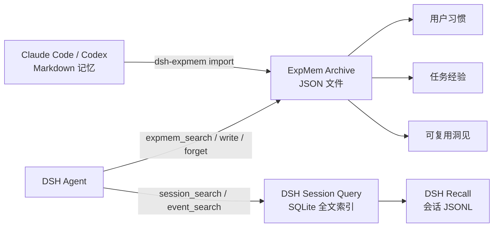

# DSH ExpMem

[English](README.md) | 简体中文

**面向 DeepSeek Harness 的经验记忆。**

DSH ExpMem 是社区插件，并非 DeepSeek 官方项目。它为 DSH Agent 提供文件型 Archive，用于沉淀用户习惯、任务经验和可复用洞见，同时复用 DSH 已有的会话历史作为 Recall。

## 架构



- **Recall** 是过往会话的原始记录。DSH 已通过 JSONL 持久化，并由 `dsh-session-query` 提供检索。
- **Archive** 是 Agent 主动提炼的稳定知识。ExpMem 为每条记录保存一个可直接检查的 JSON 文件。
- ExpMem 不复制会话事件，也不修改 Agent Loop。

## 安装

```sh
dsh plugin --profile web add @creative-dswork/dsh-expmem
```

该 bundle 会：

1. 在首次搜索时启用 DSH 已有的 session-query SQLite 后端；
2. 加载 DSH 的 `session_search`、`session_event_search`、追踪和读取工具；
3. 加载 `expmem_search`、`expmem_write` 和 `expmem_forget`。

按正常方式启动 DSH：

```sh
dsh web
```

## 导入 Claude Code 与 Codex 记忆

先预览，再一次导入两种 Agent 生成的 Markdown 记忆：

```sh
pnpm dlx @creative-dswork/dsh-expmem import all --dry-run
pnpm dlx @creative-dswork/dsh-expmem import all
```

Claude Code 默认扫描 `~/.claude/projects/**/memory/*.md`；Codex 默认扫描
`$CODEX_HOME/memories/**/*.md`，未设置 `CODEX_HOME` 时使用
`~/.codex/memories/**/*.md`。自定义目录可显式指定：

```sh
pnpm dlx @creative-dswork/dsh-expmem import claude --claude-dir /path/to/memory
pnpm dlx @creative-dswork/dsh-expmem import codex --codex-dir /path/to/memories
```

每个源文件会成为一条 `experience` 记录，并保存来源 Agent、源文件绝对路径和 SHA-256。
重复执行时，未变化的文件会跳过，内容变化的文件会原位更新；源文件不会被修改或删除。
可通过 `--workspace /path/to/project` 显式设置项目范围；使用 Claude 默认目录结构时，
ExpMem 会在映射唯一的情况下自动恢复源 workspace。

## 存储

默认文件布局：

```text
$DSH_HOME/
├── sessions/                         # DSH 持有的 Recall JSONL
└── expmem/
    ├── recall-index.sqlite           # DSH 派生的全文索引
    └── archive/
        ├── habit/<uuid>.json
        ├── experience/<uuid>.json
        └── insight/<uuid>.json
```

Archive 记录包含分类、标题、正文、标签、时间戳、可选的来源 workspace/session，以及导入来源。写入采用临时文件加原子重命名。

## 工具

| 工具 | 用途 |
|---|---|
| `session_search` | 在当前 workspace 中查找相关历史会话。 |
| `session_event_search` | 在指定历史会话内搜索事件。 |
| `expmem_search` | 跨项目或按精确 workspace 搜索提炼后的经验。 |
| `expmem_write` | 创建记录，或使用既有 UUID 更新记录。 |
| `expmem_forget` | 按分类和 UUID 删除一条 Archive 记录。 |

ExpMem 会要求 Agent 只保存稳定且经过验证的知识，不保存密钥、临时进度、原始日志或未经验证的推断。

## 配置

在 profile 的 `cordis.patch.yml` 中覆盖 `expmem`：

```yaml
- id: expmem
  config:
    rootDir: /absolute/path/to/expmem
    maxEntryChars: 20000
    maxPreviewChars: 1000
    maxSearchResults: 20
```

`rootDir` 必须是绝对路径。搜索采用不区分大小写的字面 AND 匹配，空白分隔的关键词必须全部出现；空查询会列出最新记录。

如需修改 Recall 索引位置，可覆盖 bundle 中已有的配置行：

```yaml
- id: session-query-sqlite
  config:
    path: /absolute/path/to/recall-index.sqlite
    openAt: first-search
```

## 开发

```sh
pnpm install
pnpm run check
pnpm run pack:dry-run
```

将当前 checkout 安装到 profile：

```sh
dsh plugin --profile web add .
dsh --profile web --dump-config
```

## 当前范围

- Archive 搜索采用透明的线性扫描；只有实际数据规模证明需要时才增加索引。
- 暂不包含向量检索、后台 LLM 总结器、自动记忆晋升、语义去重模型或保留周期调度。
- Recall 的删除与保留策略继续由 DSH 会话持久化负责。

## 许可证

[MIT](LICENSE)
